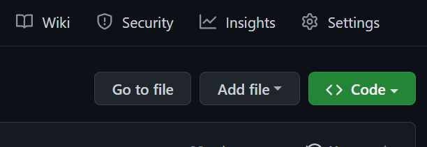
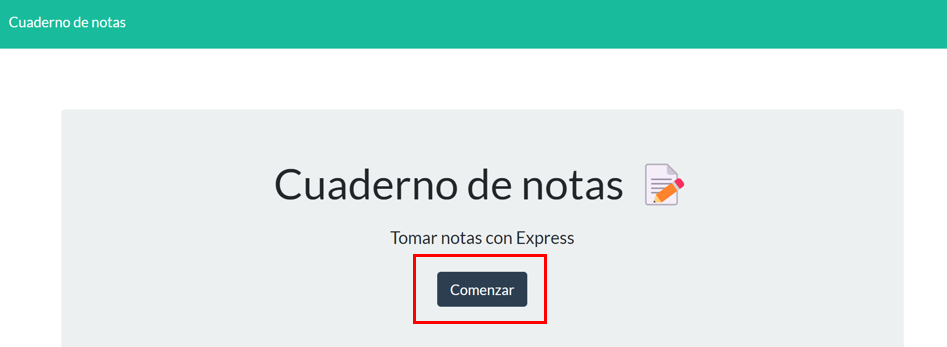
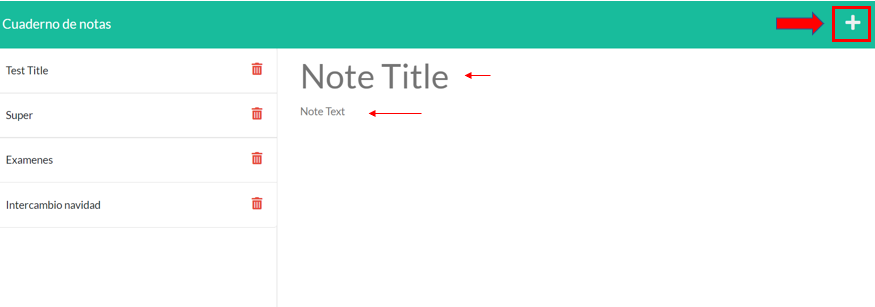
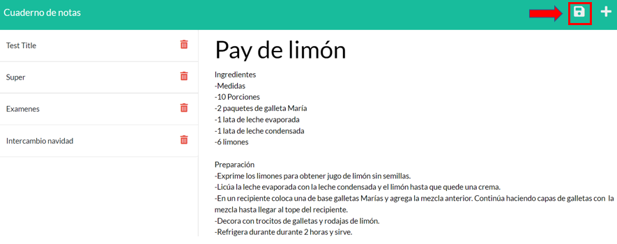

# D11-TakeNotes
Aplicación para tomar notas.

---
  ## Contenido
  1. [Enlaces](#enlaces)
  2. [Apariencia de la aplicación](#aparienciadelaaplicación)
  3. [Instalación](#instalación)
  4. [Uso](#uso)
  5. [Contribución](#contribución)
  
  
---
## Enlaces

**[Aplicación desplegada en Heroku](https://pacific-inlet-24115.herokuapp.com "click")**.

**[URL de repositorio de GitHub](https://github.com/Caro2102/D11-TakeNotes "click")**.

---
## Apariencia de la aplicación
- Captura de pantalla del la pagina de inicio

    
- Captura de pantalla de la pagina de notas

    

---
  ## Instalación
- Clonar repositorio
    - Abrir el siguiente link **[URL de repositorio de GitHub](https://github.com/Caro2102/D10-TeamGenerator "click")**.
    - Hacer click en <> Code.

        
    - Copiar la direccion URL del repositorio.

        
    - Abrir GitBash.
    - Ir a la ubicacion en donde quieres clonar el repositorio.
    - Escribir **`git clone`** y pegar la url antes copiada.
    - Presionar enter para clonar.

- Instalar node desde la pagina oficial **[NodeJS web Oficial](https://nodejs.org/es/ "click")**.
    - Abrir GitBash.
    - Ir a la ubicacion en donde se clonó el repositorio.
    - Escribir **`npm i`** para instalar las dependencias del proyecto.
    - Con esto instalaremos todas las dependecias que tengamos en el package.json y nos creará una carpeta llamada **node_modules** con las dependencias listas para utilizar.
    - Escribir **`npm start`** para ejecutar el archivo.
    - En el navegador dirigirse a la dirección **[http://localhost:5000](http://localhost:5000 )**.

---
## Uso
- Ingresar a la aplicación desplegada en **[Heroku](https://pacific-inlet-24115.herokuapp.com "click")** o acceder desde el navegador  con la direccion [http://localhost:5000](http://localhost:5000 ) despues de haber ejecutado el archivo como muestra la seccion de [Instalación](#instalación).
- Dar click en comenzar para redirigirse a pagina de notas.
    
    
- Para crear una nota nueva dar click en **`+`** . Escribir el titulo de la nota en **`Note Title`** y la nota en **`Note Text`**.

    

- Dar click en el icono **`💾`** para guardar nota.

    

---
## Contribución:
    
  Para contribuir con este proyecto:
- Fork del repositorio.
- Clonar el  repositorio.
- Actualizar la rama master.

        $git pull -r upstream master
- Crear rama.

        $ git checkout -b feature-nombre-rama
- Realizar cambios, agregarlos, hacer commit y despues hacer push hacia nuestro repositorio indicando la rama que hemos creado.

        $ git push origin feature-nombre-rama
- Hacer un Pull Request.
- Esperar que el codigo se acepte y se haga merge.

